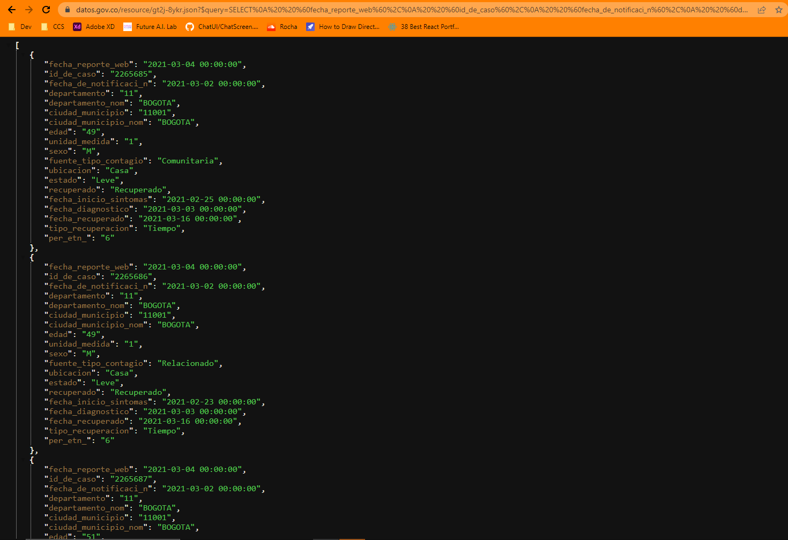
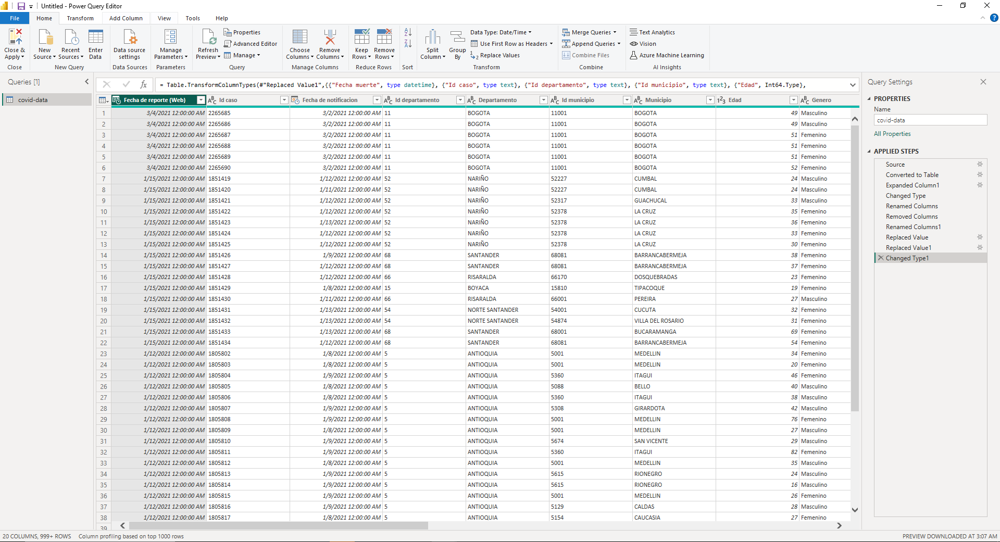

<a name="readme-top"></a>


<!-- PROJECT LOGO -->
<br />
<div align="center">
   
  <h3 align="center">Casos positivos de Covid-19 en Colombia</h3>

  <p align="center">
    Salud y proteccion social
    Corte 07-06-2023
    <br />
    <br />
    <a href=" https://www.datos.gov.co/Salud-y-Protecci-n-Social/Casos-positivos-de-COVID-19-en-Colombia/gt2j-8ykr">Conjunto de datos</a>
    .
    <a href="https://www.ins.gov.co/Noticias/Paginas/Coronavirus.aspx">Visualizacion</a>
     .
    <a href="https://www.datos.gov.co/resource/gt2j-8ykr.json?$query=SELECT%0A%20%20%60fecha_reporte_web%60%2C%0A%20%20%60id_de_caso%60%2C%0A%20%20%60fecha_de_notificaci_n%60%2C%0A%20%20%60departamento%60%2C%0A%20%20%60departamento_nom%60%2C%0A%20%20%60ciudad_municipio%60%2C%0A%20%20%60ciudad_municipio_nom%60%2C%0A%20%20%60edad%60%2C%0A%20%20%60unidad_medida%60%2C%0A%20%20%60sexo%60%2C%0A%20%20%60fuente_tipo_contagio%60%2C%0A%20%20%60ubicacion%60%2C%0A%20%20%60estado%60%2C%0A%20%20%60pais_viajo_1_cod%60%2C%0A%20%20%60pais_viajo_1_nom%60%2C%0A%20%20%60recuperado%60%2C%0A%20%20%60fecha_inicio_sintomas%60%2C%0A%20%20%60fecha_muerte%60%2C%0A%20%20%60fecha_diagnostico%60%2C%0A%20%20%60fecha_recuperado%60%2C%0A%20%20%60tipo_recuperacion%60%2C%0A%20%20%60per_etn_%60%2C%0A%20%20%60nom_grupo_%60
">JSON file</a>.
  </p>
</div>

 

### Construido

* Angular.io


### Prerrequisitos

Instalar dependencias
* npm
  ```sh
  npm install npm@latest -g
  ```
  ```sh
  npm start
  ```


## Pasos Power BI

- Importar datos
- Preparacion de los datos
- Modelar los datos
- Visualizacion de los datos
- Data reporting


<!-- CONTRIBUTING -->
## Contribucion

Contributions are what make the open source community such an amazing place to learn, inspire, and create. Any contributions you make are **greatly appreciated**.

If you have a suggestion that would make this better, please fork the repo and create a pull request. You can also simply open an issue with the tag "enhancement".
Don't forget to give the project a star! Thanks again!

1. Fork the Project
2. Create your Feature Branch (`git checkout -b feature/AmazingFeature`)
3. Commit your Changes (`git commit -m 'Add some AmazingFeature'`)
4. Push to the Branch (`git push origin feature/AmazingFeature`)
5. Open a Pull Request
